# Azure Highly Available Web Tier

A highly available web tier on Azure, built with Terraform: three IIS web servers spread across availability zones, sitting behind a zone-redundant load balancer, with no public RDP surface. All admin access goes through Azure Bastion. State is stored remotely in Azure Storage, and load balancer's backend health is monitored with an alert that emails on failure.

## Architecture

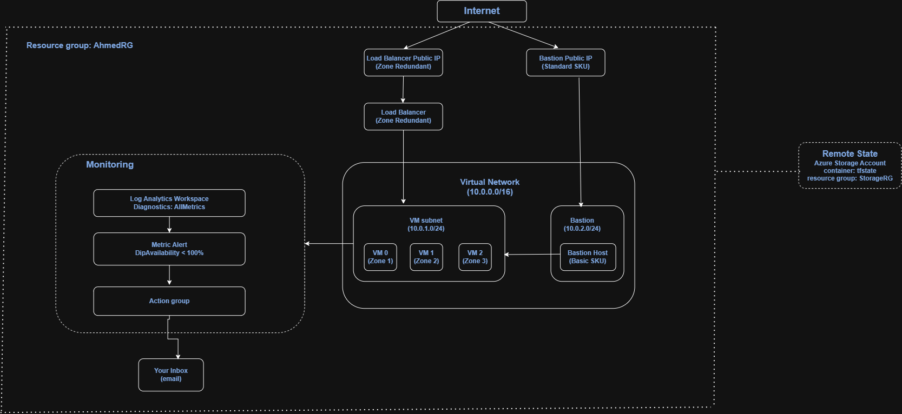

- **Internet** reaches the environment through two public IPs: one for the load balancer, one for Bastion.
- **Load balancer** (Standard SKU, zone-redundant frontend) receives HTTP on port 80 and forwards it to the VM backend pool. A health probe on port 80 keeps traffic off any VM that stops responding.
- **VM subnet** (`10.0.1.0/24`) holds three Windows Server 2019 VMs running IIS, one in each availability zone (1, 2, 3). None of them has a public IP.
- **Bastion subnet** (`10.0.2.0/24`) holds the Bastion host, which connects to the VMs over their private IPs. This is the only path in for RDP.
- **NSG** on the VM subnet allows inbound HTTP from the internet and outbound internet access; nothing else is open.
- **Monitoring** — the load balancer sends diagnostics and metrics to a Log Analytics workspace. A metric alert watches DipAvailability and, if it drops below 100%, notifies an action group, which emails an admin.
- **Remote state** — Terraform state is stored in an Azure Storage container (tfstate), in a separate resource group (StorageRG) from the application resources (AhmedRG). This is provisioned by its own small Terraform config, run once, before the main project.

## Prerequisites

- An Azure subscription
- Terraform >= 1.x
- Azure CLI, logged in (`az login`)
- An email address to receive health alerts

## Remote state setup (one-time)

The main project's provider.tf points at a remote backend, so the storage account and container it needs must exist before the main project is initialized. This lives in a separate folder (Storage.tf / storage_variables.tf) with its own local state, run once:

```bash
cd remotebackend          # or wherever the Storage.tf config lives
terraform init
terraform apply
```

This creates:
- A resource group `StorageRG`
- A Storage account for state `ahmedincloudstoragexx` 
- A private blob container named `tfstate`

## Note the storage account name from the output, and confirm it matches storage_account_name in the main project's provider.tf backend block. Backend blocks can't reference variables, so this value is hardcoded there.

The main project's `provider.tf` already points at this backend, so once the storage exists, `terraform init` in the main folder connects to it automatically.

## Deployment

```bash
git clone <repo-url>
cd <repo-folder>
cp terraform.tfvars.example terraform.tfvars   # fill in your own values
terraform init
terraform plan
terraform apply
```

Once it finishes:

```bash
terraform output load_balancer_public_ip_Address
```

Open `http://<that-ip>` in a private/incognito window. Refresh a few times, the load balancer may keep sending you to the same VM, so use separate incognito sessions or different browsers to see the others answer.

**Confirm the alert email**: after the first apply, Azure sends a verification email to the address in `email_address_for_alerts`. Click confirm. An unverified receiver won't get notified when the alert fires.

## Teardown

```bash
terraform destroy
```

When you are done testing, run this in the main project folder only, it does not touch the `remotebackend` state or the storage account, by design. VMs, the load balancer, Bastion, and the monitoring resources all bill while running.

## Design decisions

- **Bastion instead of public RDP.** The VMs have no public IP. Admin access goes through Bastion, which connects over the VMs' private IPs.
- **HTTP only, no HTTPS.** IIS is serving plain HTTP for this lab. Adding HTTPS would mean a certificate and a binding on each VM, left out here to keep the config focused.
- **Load balancer outbound rule instead of a NAT Gateway.** Both give a subnet outbound internet access. A NAT Gateway is the more common pattern for larger workloads, but it's tied to a single zone (or none), which would work against the zone-redundant design here. The load balancer's outbound rule, on a zone-redundant frontend, keeps outbound access consistent with the rest of the architecture.
- **VMs spread across availability zones.** Each VM sits in a different zone (1, 2, 3), and the load balancer's public IP is zone-redundant, so the site stays reachable if one zone goes down.
- **Remote state in a separate resource group.** Keeping `StorageRG` apart from `AhmedRG` means `terraform destroy` on the main project can never accidentaly delete the state backend.
- **Monitoring on the load balancer, not each VM.** `DipAvailability` reflects the backend pool as a whole, which is what actually matters for "is the site up". A single VM's health is only interesting insofar as it affects that.

## The outbound access issue

The IIS install script failed on every VM with the same error: 
Install-WindowsFeature : The request to add or remove features on the specified server failed.
Error: 0x80072ee2

That error means Windows couldn't reach the internet to pull the IIS installation payload. Pinging the load balancer's public IP from outside worked, but running `Test-NetConnection` from inside the VMs to outbound targets (Windows Update endpoints) timed out. DNS resolved, but nothing connected.

The cause: this load balancer is Standard SKU, and Standard SKU doesn't provide the automatic outbound internet access. The VMs were in the backend pool for an inbound rule only, with no outbound rule configured, so they had no path out at all.

The fix was an explicit `azurerm_lb_outbound_rule`, pointed at the same frontend IP and backend pool. Azure then required the existing inbound rule to set `disable_outbound_snat = true`, since a frontend IP can't provide both automatic and rule-based SNAT for the same backend pool at once. Once both were in place, the VMs had a route out, and the IIS install succeeded.

## Results

Screenshots showing the deployed environment actually working:

1. **`terraform apply` completing successfully** — full output showing all resources created with no errors.

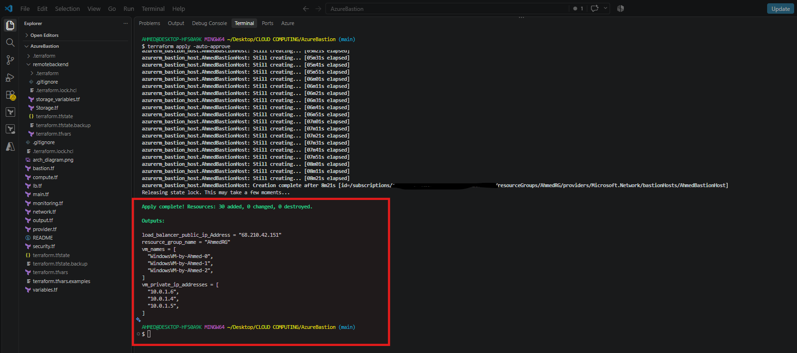

2. **The website loading** — browser window at `http://68.210.42.151`, showing the IIS page with the responding VM's number/hostname.

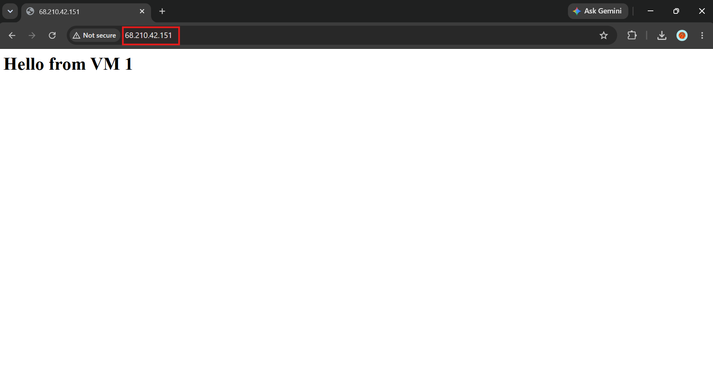

3. **Three different VMs answering** — three incognito windows side by side , each showing a different `VM 0` / `VM 1` / `VM 2` response, proving the load balancer is distributing traffic.

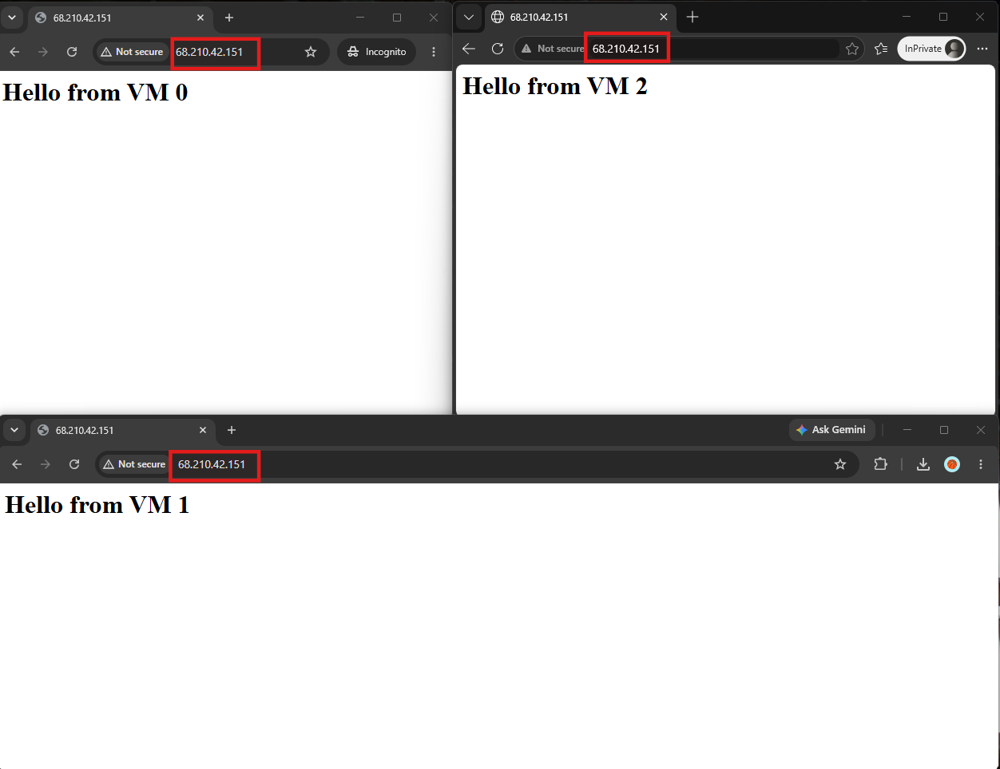

4. **Bastion connection** — the Azure Portal's Bastion connect screen, and/or an RDP session open to one of the VMs, showing there's no public IP involved.

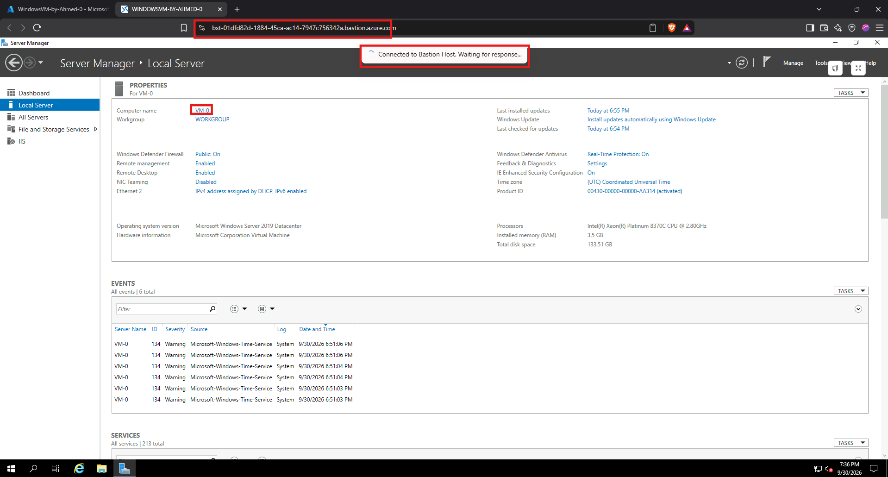

5. **The failover test** — one VM stopped in the Azure Portal, with the website still loading successfully in a browser refresh right after.

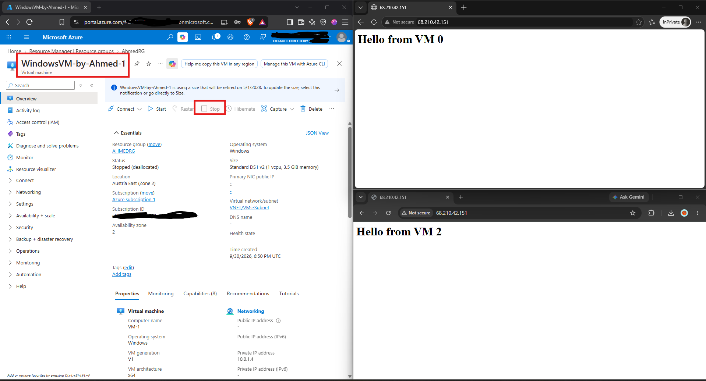

6. **The health alert firing** — the email received from the action group after stopping a VM, showing the alert text and timestamp.

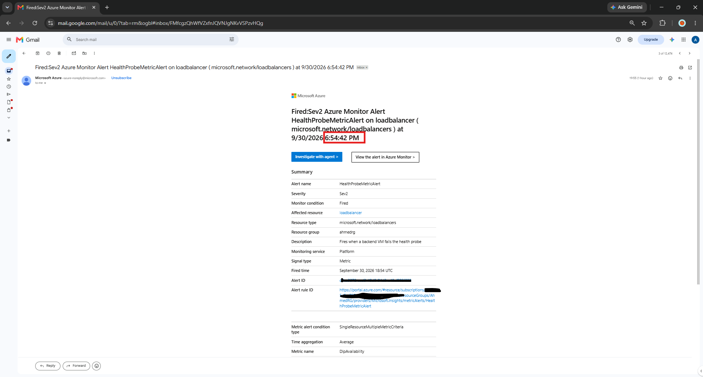

7. **Alert resolving after the VM was restarted** — a second email from the action group, marked "Resolved," confirming the health probe returned to 100% availability. Comparing this timestamp against the original "Fired" email shows how long the backend was unhealthy before recovering.

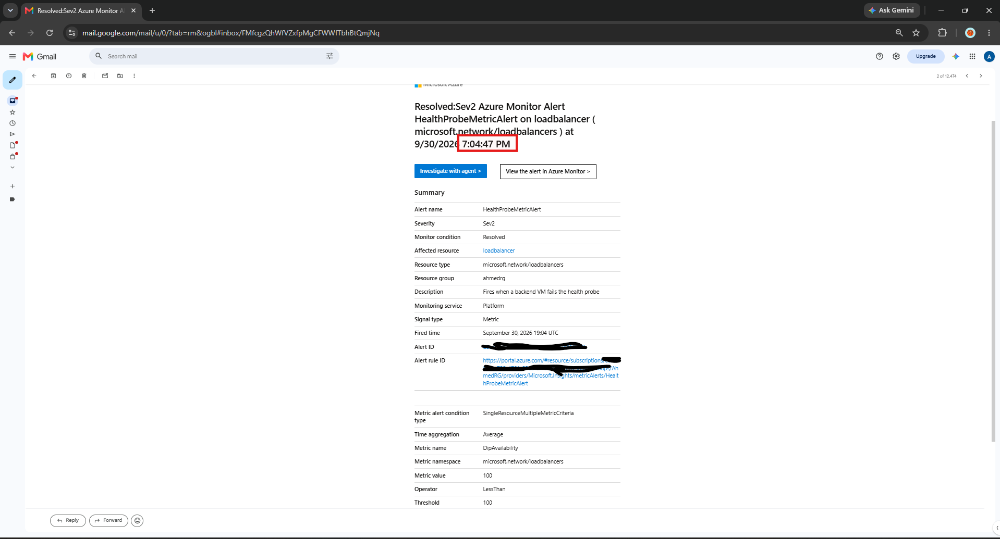

8. **The failure visible on the Health Probe Status chart** — the split-by-backend view confirms `10.0.1.4` stops reporting data (shown as `--`) while `10.0.1.6` and `10.0.1.5` hold steady at 100, isolating the failure to the one stopped VM rather than the whole pool.

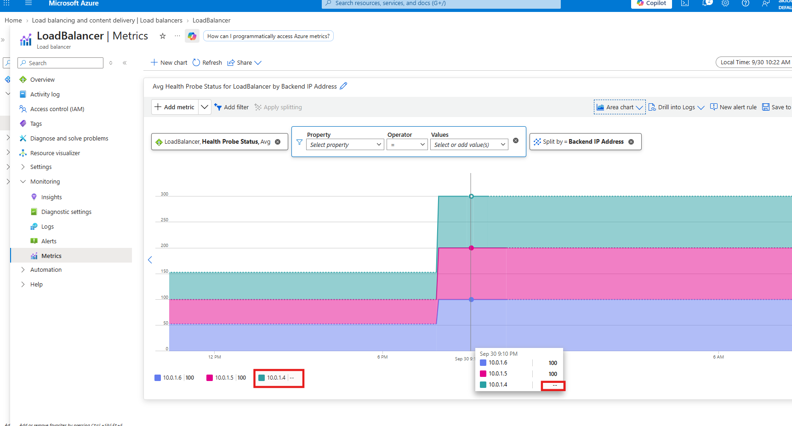

**8b. Zoomed to the outage window (9:05-9:15 PM)** — narrowing the time range isolates the exact moment `10.0.1.4` drops out, with the other two backends unaffected throughout.

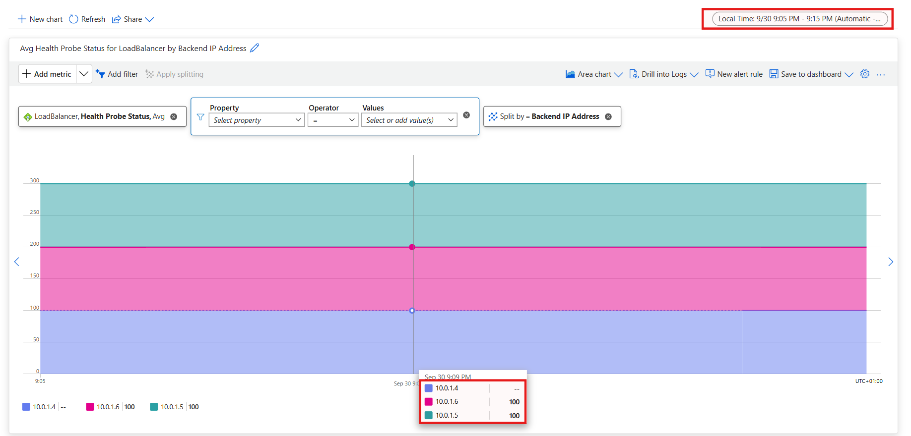

9. **Remote state confirmed in Azure Storage** — the `tfstate` container inside the `ahmedincloudstoragexx` storage account, showing `terraform.tfstate` as a blob. Opening it confirms the state tracks the real deployed resources (resource group `AhmedRG`, the three VM names, and their private IPs), proving state isn't stored locally.

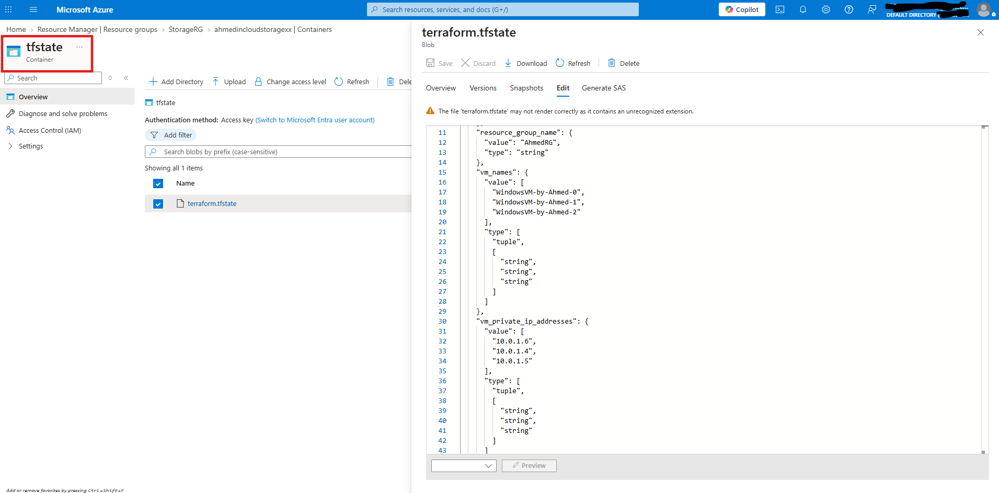